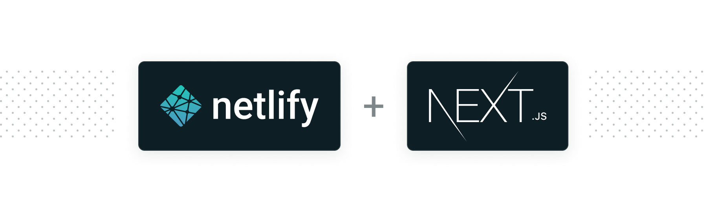

# Essential Next.js Build Plugin

<p align="center">
  <a aria-label="npm version" href="https://www.npmjs.com/package/@netlify/plugin-nextjs">
    
  </a>
  <a aria-label="MIT License" href="https://img.shields.io/npm/l/@netlify/plugin-nextjs">
    
  </a>
</p>

This build plugin is a utility for supporting Next.js on Netlify. To enable server-side rendering and other framework-specific features in your Next.js application on Netlify, you will need to install this plugin for your app.

## Table of Contents

- [Installation and Configuration](#installation-and-configuration)
- [Docs](#docs)
- [Credits](#credits)

## Installation and Configuration

### For new Next.js sites

As of v3.0.0, all new sites deployed to Netlify with Next.js will automatically install this plugin for a seamless experience deploying Next.js on Netlify!

This means that you don't have to do anything — just build and deploy your site to Netlify as usual and we'll handle the rest.

You're able to [remove the plugin](https://docs.netlify.com/configure-builds/build-plugins/#remove-a-plugin) at any time by visiting the **Plugins** tab for your site in the Netlify UI.

### For existing Next.js sites

### UI Installation

If your Next.js project was already deployed to Netlify pre-3.0.0, use the Netlify UI to [install the Essential Next.js Build Plugin](http://app.netlify.com/plugins/@netlify/plugin-nextjs/install) in a few clicks.

### Manual installation

1\. Create a `netlify.toml` in the root of your project. Your file should include the plugins section below:

```toml
[build]
  command = "npm run build"
  publish = "out"

[[plugins]]
  package = "@netlify/plugin-nextjs"
```

Note: the plugin does not run for statically exported Next.js sites (aka sites that use `next export`). To use the plugin, you should use the `[build]` config in the .toml snippet above. Be sure to exclude `next export` from your build script. 
The plugin will attempt to detect if the site uses static export or Storybook, and will not run for either. If you want to disable the auto-detection, you can set the `NEXT_PLUGIN_FORCE_RUN` environment variable to `true` or `false`. 
Setting it to `true` or `1` will mean the plugin always runs, and setting it to `false` or `0` will mean it never runs. If unset, auto-detection will be used. This variable should be set in the Netlify UI or in the `netlify.toml` file.

2\. From your project's base directory, use `npm`, `yarn`, or any other Node.js package manager to add this plugin to `dependencies` in `package.json`.

```
npm install --save @netlify/plugin-nextjs
```

or

```
yarn add @netlify/plugin-nextjs
```

Read more about [file-based plugin installation](https://docs.netlify.com/configure-builds/build-plugins/#file-based-installation) in our docs.

## Docs

- [CLI Usage](https://github.com/netlify/netlify-plugin-nextjs/tree/main/docs/cli-usage.md)
- [Custom Netlify Functions](https://github.com/netlify/netlify-plugin-nextjs/tree/main/docs/custom-functions.md)
- [Image Handling](https://github.com/netlify/netlify-plugin-nextjs/tree/main/docs/image-handling.md)
- [Monorepos and Nx](https://github.com/netlify/netlify-plugin-nextjs/tree/main/docs/monorepos.md)
- [Custom Netlify Redirects](https://github.com/netlify/netlify-plugin-nextjs/tree/main/docs/custom-redirects.md)
- [Local Files in Runtime](https://github.com/netlify/netlify-plugin-nextjs/tree/main/docs/local-files-in-runtime.md)
- [FAQ](https://github.com/netlify/netlify-plugin-nextjs/tree/main/docs/faq.md)
- [Caveats](https://github.com/netlify/netlify-plugin-nextjs/tree/main/docs/caveats.md)

## Credits

This package extends the project [next-on-netlify](https://github.com/netlify/next-on-netlify), authored originally by [Finn Woelm](https://github.com/finnwoelm).
