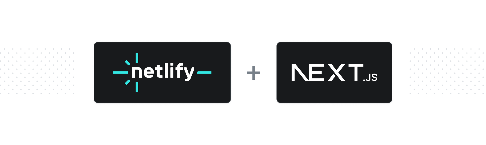

# Next.js Runtime

<p align="center">
  <a aria-label="npm version" href="https://www.npmjs.com/package/@netlify/plugin-nextjs">
    
  </a>
  <a aria-label="MIT License" href="https://img.shields.io/npm/l/@netlify/plugin-nextjs">
    
  </a>
</p>

This package handles the build process and creates the runtime environment for Next.js sites on
Netlify. You should not normally need to install it yourself, as it is used automatically during
builds of Next.js sites. See
[the docs for using Next.js on Netlify](https://docs.netlify.com/frameworks/next-js/overview/) for
more details.

Next.js is supported natively on Netlify, and in most cases you will not need to install or
configure anything. This repo includes the packages used to support Next.js on Netlify.

## Prerequisites

- Next.js 13.5 or later
- Node.js 18 or later
- The latest version of the [Netlify CLI](https://docs.netlify.com/cli/get-started/)

## Deploying

If you build on Netlify, the Next.js Runtime will work with no additional configuration.

## Manually installing the Next.js Runtime

The Next.js Runtime installs automatically for new Next.js sites on Netlify. You can also install it
manually in the following ways:

### From the UI (Recommended)

You can go to the [UI](https://app.netlify.com/plugins/@netlify/plugin-nextjs/install) and choose
the site to install the Next.js Runtime on. This method is recommended because you will benefit from
auto-upgrades to important fixes and feature updates.

### From `npm`

```shell
npm install -D @netlify/plugin-nextjs
```

...then add the following to your `netlify.toml` file:

```toml
[[plugins]]
  package = "@netlify/plugin-nextjs"
```

This method is recommended if you wish to pin the Next.js Runtime to a specific version.

## v4

If you are using Next.js 10-13.4 or Node.js < 18, you must use v4 of the Next.js Runtime.

If you are still using v4, you can find
[its README here](https://github.com/netlify/next-runtime/blob/v4/README.md) and the
[v4 Runtime docs here](https://docs.netlify.com/frameworks/next-js/runtime-v4/overview/).

### Upgrading from v4 to v5

To upgrade from v4 to v5, please visit
[the v5 documentation](https://docs.netlify.com/frameworks/next-js/overview/).

## Feedback

If you think you have found a bug in Next.js on Netlify,
[please open an issue](https://github.com/opennextjs/opennextjs-netlify/issues). If you have
comments or feature requests,
[see the discussion board](https://github.com/opennextjs/opennextjs-netlify/discussions)

Please note that v4 will only receive security fixes and critical bug fixes.
